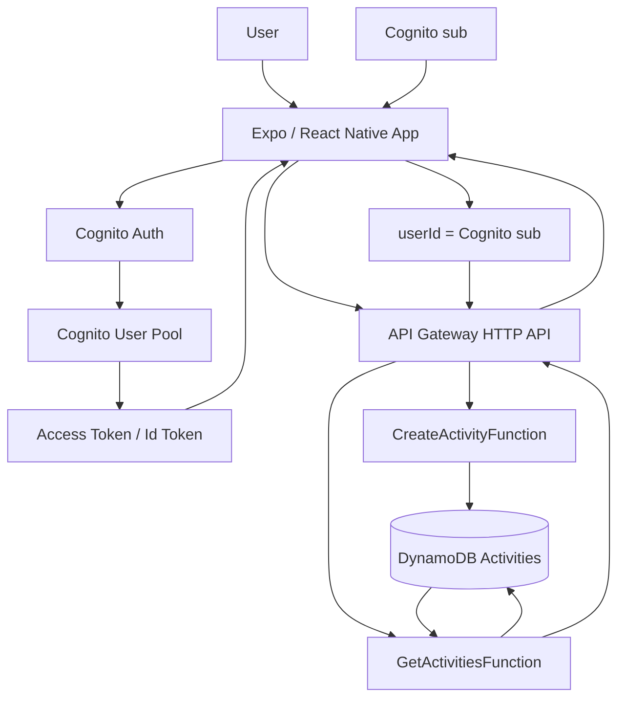
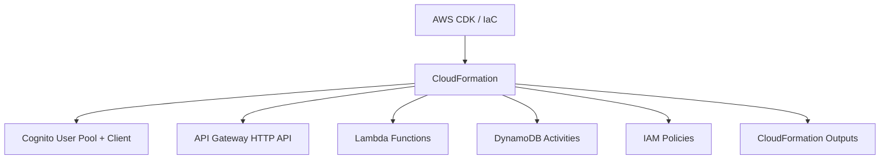
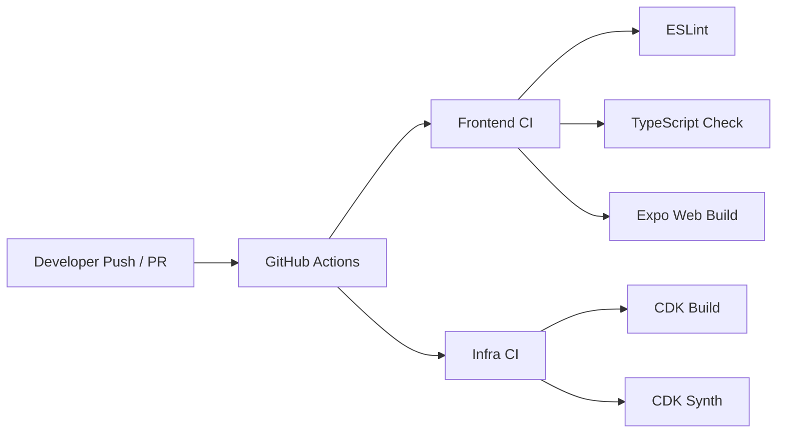

# MusicOS Architecture

## Application Flow

```mermaid
flowchart TD
  User[User] --> App[Expo / React Native App]

  App --> Auth[Cognito Auth]
  Auth --> UserPool[Cognito User Pool]
  UserPool --> Token[Access Token / Id Token]
  Token --> App

  App --> API[API Gateway HTTP API]

  API --> CreateLambda[CreateActivityFunction]
  API --> GetLambda[GetActivitiesFunction]

  CreateLambda --> DynamoDB[(DynamoDB Activities)]
  GetLambda --> DynamoDB

  DynamoDB --> GetLambda
  GetLambda --> API
  API --> App

  sub[Cognito sub] --> App
  App --> userId[userId = Cognito sub]
  userId --> API
```

## Infrastructure as Code

```mermaid
flowchart TD
  CDK[AWS CDK / IaC] --> CFN[CloudFormation]
  CFN --> Cognito[Cognito User Pool + Client]
  CFN --> ApiGateway[API Gateway HTTP API]
  CFN --> Lambda[Lambda Functions]
  CFN --> DynamoDB[DynamoDB Activities]
  CFN --> IAM[IAM Policies]
  CFN --> Outputs[CloudFormation Outputs]
```

## CI/CD

```mermaid
flowchart LR
  Dev[Developer Push / PR] --> GHA[GitHub Actions]

  GHA --> FrontendCI[Frontend CI]
  FrontendCI --> Lint[ESLint]
  FrontendCI --> TypeCheck[TypeScript Check]
  FrontendCI --> WebBuild[Expo Web Build]

  GHA --> InfraCI[Infra CI]
  InfraCI --> CDKBuild[CDK Build]
  InfraCI --> CDKSynth[CDK Synth]
```
